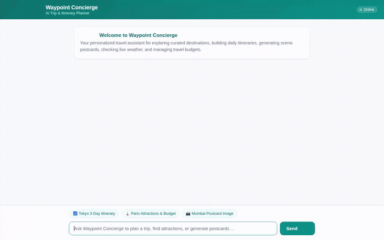

# Waypoint Concierge · AI Trip Planner & Concierge



> An agentic travel assistant built with the **Agent Development Kit (ADK)**, **Gemini 2.5 Flash**, **Vertex AI Agent Engine**, and the **A2A Protocol**.

Waypoint Concierge helps travelers plan personalized itineraries with curated destinations, activities, and dining spots, complete with persistent traveler memory, budget calculations in a sandboxed Python runtime, scenic postcard generation, and rich interactive A2UI card interfaces.

---

## 🌟 Key Features & Tools

- **Curated Destination & Activity Discovery**:
  - Searches places, attractions, and dining options using the Google Places & Geocoding APIs.
  - Queries local weather, timezones, and operational details.
- **Cross-Session Long-Term Memory**:
  - Integrated with **Vertex AI Memory Bank** to persist traveler profiles, pacing styles, dietary restrictions, and allergy requirements across conversations.
- **Code Execution Sandbox**:
  - Leverages **Vertex AI Agent Engine Sandbox Code Executor** (`AgentEngineSandboxCodeExecutor`) to safely run Python for precise trip budget calculations, currency conversions, and travel math.
- **Scenic Postcard Image Generation**:
  - Generates destination postcards using `gemini-3.1-flash-lite-image`, automatically registering artifacts and publishing images to Google Cloud Storage.
- **Rich A2UI Display**:
  - Emits A2UI (v0.8 Basic Catalog) components so itineraries, recommendations, and postcards render as cards, columns, rows, and media instead of plain text blocks.
- **Chat Web Frontend & FastAPI Proxy**:
  - Includes a lightweight FastAPI web proxy and responsive chat UI communicating with the deployed agent over the **A2A (Agent-to-Agent)** protocol.

---

## 🏗️ Project Architecture

```
waypoint-concierge/
├── app/
│   ├── agent.py               # Root Agent declaration, prompts, memory, & tool registration
│   ├── image_tool.py          # Gemini 3.1 Flash Lite Image generation tool & GCS uploader
│   ├── places_tool.py         # Google Places & Geocoding API search tools
│   ├── travel_tools.py        # Weather, timezone, and itinerary state tools
│   ├── a2ui_utils.py          # A2UI after_model_callback transformer
│   ├── sandbox.py             # Agent Engine Code Execution sandbox integration
│   └── fast_api_app.py        # ADK FastAPI service entrypoint
├── frontend/
│   ├── main.py                # FastAPI proxy connecting browser to Agent Runtime over A2A
│   ├── static/
│   │   └── index.html         # Responsive Chat UI with A2UI renderer and prompt chips
│   ├── Dockerfile             # Container configuration for Cloud Run
│   └── requirements.txt       # Frontend proxy dependencies (FastAPI, a2a-sdk, httpx)
├── pyproject.toml             # Agent dependencies & metadata
├── agents-cli-manifest.yaml   # Agent Engine deployment manifest
└── project_brief.md           # Project requirements & specification
```

---

## 🚀 Getting Started

### Prerequisites

- Python 3.12+
- [`uv`](https://docs.astral.sh/uv/) package manager
- [`google-agents-cli`](https://github.com/google-gemini/agents-cli)
- Google Cloud SDK (`gcloud`) with active GCP credentials

### 1. Local Agent Development

Clone the repository and install dependencies:

```bash
uv sync
```

Set up your `.env` file (see `.env.example`):
```bash
GOOGLE_MAPS_API_KEY="your_key_here"
```

Start the ADK development playground:

```bash
uv run adk web . --port 8080 --reload_agents
```

### 2. Running the Web Frontend

Navigate to the `frontend/` directory and install dependencies:

```bash
cd frontend
python -m venv .venv
source .venv/bin/activate
pip install -r requirements.txt
```

Run the FastAPI proxy server:

```bash
export AGENT_ENGINE_RESOURCE_NAME="projects/<PROJECT>/locations/<LOCATION>/reasoningEngines/<ID>"
export AGENT_DIRECTORY="app"
export PORT=8080
python main.py
```

Visit `http://localhost:8080` in your browser.

---

## 📜 License

Apache License 2.0
